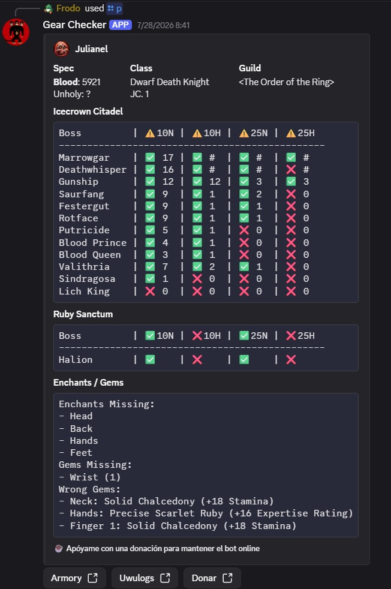

# GsChecker

Bot de Discord para consultar personajes de Warmane (WotLK), con foco en resumen de progreso PvE/PvP, calidad de equipo y DPS por boss.

Scrapea directamente `armory.warmane.com` (HTML + API JSON) y `uwu-logs.xyz`.

## Features

- **GearScore** calculado localmente a partir de los ítems equipados (tabla WotLK).
- **Resumen de personaje** (embed) con:
  - clase / raza / nivel,
  - specs activa e inactiva con ícono,
  - guild y rango dentro de la guild,
  - progreso **ICC 10/25** (Normal y Heroic) por boss,
  - **Ruby Sanctum** (Halion) por logros The Twilight Destroyer,
  - profesiones,
  - enchants y gemas faltantes,
  - GearScore por spec (cachea el GS de cada spec en Postgres para mostrarlas todas),
  - links a Armory y UwU Logs.
- **DPS por boss** (máximo y promedio) vía uwu-logs.xyz, con overview rápido y tabla detallada.
- **Trial of the Crusader**: logros 10N / 10H / 25N / 25H.
- **Auditoría por IA**: análisis BiS + resumen de coach (Groq) sobre equipo actual.
- **Cache en memoria + Postgres** (`external_api_cache`) para reducir requests al Armory / UwU.
- **Retries con jittered backoff (3–5s)** para rate-limits Cloudflare del Armory (429 / 5xx).

## Comandos

| Comando                     | Descripción                                              | Reino               |
|-----------------------------|----------------------------------------------------------|---------------------|
| `/personaje <nombre> [reino]` | Perfil completo del personaje.                         | Configurable        |
| `/p <nombre> [reino]`        | Alias corto de `/personaje`.                            | Configurable        |
| `/dps <nombre> [spec]`       | DPS por boss desde UwU Logs.                            | Lordaeron           |
| `/ptoc <nombre>`             | Logros ToC (10N/10H/25N/25H) en tabla.                  | Lordaeron           |
| `/ia <nombre> [reino]`       | Auditoría BiS + coach summary por LLM (Groq).           | Configurable        |
| `/ping`                      | Latencia actual del bot.                                | —                   |

Reinos aceptados en `[reino]` (por defecto **Lordaeron**):

- Lordaeron
- Icecrown
- Blackrock
- Onyxia
- Frostmourne

## Instalación

Requiere Python 3.11.

```bash
git clone https://github.com/joaquinmuzzi/GsChecker.git
cd GsChecker
cp .env.example .env   # y editar
```

Variables mínimas en `.env`:

```bash
DISCORD_TOKEN=tu_token
# Opcional — habilita cache externa en Postgres
DATABASE_URL=postgres://...
# Opcional — necesario solo para /ia
GROQ_API_KEY=...
```

### Ejecutar

```bash
# A) Script (crea venv, instala deps y arranca)
./run.sh

# B) venv + pip
python3 -m venv venv
source venv/bin/activate
pip install -r requirements.txt
python main.py

# C) Poetry
poetry install
poetry run python main.py
```

## Deploy en Railway

El repo incluye lo necesario para correrlo como **worker**:

- `Procfile` — `worker: bash ./run_railway.sh`
- `railway.toml` — Nixpacks + restart on failure (10 reintentos)
- `run_railway.sh` — carga `.env` y ejecuta `python3 main.py`

Variables recomendadas en Railway:

- `DISCORD_TOKEN` (requerido)
- `DATABASE_URL` (opcional — pero muy recomendado para cache de GS por spec)
- `GROQ_API_KEY` (opcional — solo para `/ia`)

Este servicio es worker: no expone puerto HTTP.

## Logging

Cada invocación de comando emite una línea estructurada en el logger `gschecker.commands`:

```text
command=p user=Frodo(123456789) guild=Durotar(987654321) character='Samsara' realm='Lordaeron'
```

Los logs van a:

- **stdout** — visibles en Railway → *Deploy Logs* (filtrando por `@level:info`).
- **`logs/bot.log`** — rotating file (2 MB × 5 backups) por si corrés local.
- **`logs/bot-errors.log`** — mismo rotating solo para `ERROR`.

Los sub-loggers heredan del logger raíz `gschecker` (configurado en `main.py`):

- `gschecker.commands` — comandos slash.
- `gschecker.warmane` — integración Armory.
- `gschecker.profile_scraper` — parsing de gear.
- `gschecker.postgres` — cache externa.

## Arquitectura

```
main.py                        # arranque, sync slash, lock de proceso, logging global
gearscore.py                   # cálculo local de GS a partir de item IDs (static/GS.json)
profile_scraper.py             # scraping HTML de armory.warmane.com (gear, enchants, gems)

src/
├── controller/
│   └── commands.py            # /personaje /p /dps /ptoc /ia /ping — orquestación
├── functions/
│   ├── warmane.py             # summary/specs/achievements/gear/stats/guild-rank
│   ├── uwu.py                 # integración uwu-logs.xyz (overview + DPS por boss)
│   ├── embeds.py              # armado de embeds y tablas monoespaciadas
│   └── cache.py               # get/set/get_stale in-memory
├── audit/
│   ├── auditor.py             # comparación equipo vs BiS guide
│   ├── bis_guides.py          # guías BiS hardcoded por class+spec
│   ├── coach.py               # resumen narrativo vía Groq
│   ├── integration.py         # bridge scraper → audit
│   └── models.py              # Pydantic models
├── db/
│   └── postgres.py            # cache externa (tabla external_api_cache)
└── schemas/
    └── constants.py           # TTLs, caches in-memory, mapeos de boss/spec

static/
├── GS.json                    # tabla WotLK: item_id → ilvl bucket → GS por slot type
├── gem_data.json              # mapeos gem enchant_id → item info
├── item_sockets_cache.json    # sockets por item_id (evita hits a evowow)
└── raid_items_extra.json      # IDs extra para precarga

tools/
├── preload_character_gs.py    # precarga GS por spec desde UwU Logs
└── preload_item_sockets_cache.py  # precarga sockets de items de raid
```

## Cache

Dos niveles:

- **In-memory** (`src/schemas/constants.py`): dicts `{key: (timestamp, value)}` por dominio (SUMMARY, GEAR, ACHIEVEMENTS, STATS, …) con TTLs entre 120 s y 300 s. Se pierde al reiniciar el proceso.
- **Postgres** (`external_api_cache`): persiste comandos completos y GS por spec (`CHARACTER_SPEC_GS_TTL = 30 días`). Requiere `DATABASE_URL`.

Al escribir cache **nunca** se persiste una respuesta vacía — sólo respuestas completas. Si el Armory falla, se cae a stale cache si existe, y si no, se retorna vacío sin envenenar el TTL.

## Diagnóstico y notas conocidas

- El Armory de Warmane responde con 429 / 5xx bajo carga; hay retry con jittered backoff 3–5 s (`_armory_get` y `_warmane_get_with_scheme_fallback`).
- `/dps` depende 100% de uwu-logs.xyz; si están lentos, el timeout es 45 s.
- El GS por spec se sirve desde Postgres una vez que el bot vio al personaje en esa spec; primera vez muestra `?` en las specs no activas.
- La API JSON del Armory (`/api/character/.../summary`) no devuelve `gearScore` — se calcula siempre localmente desde el equipo scrapeado.

## Ejemplo



## Code Reuse

Este proyecto reutiliza ideas y mapeos de IDs / logros inspirados en **WarmaneProfileParser** (MIT):

- <https://github.com/Ridepad/WarmaneProfileParser>

## Licencia

MIT — ver [LICENSE](LICENSE).
