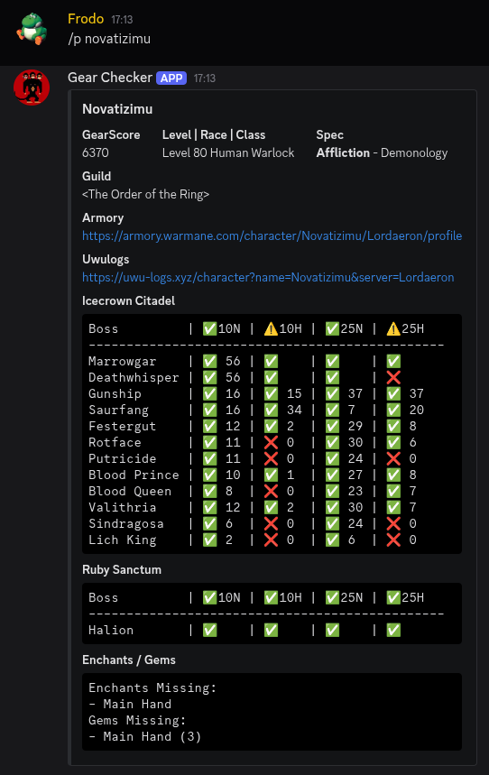

# GsChecker

Bot de Discord para consultar personajes de Warmane (WotLK), con foco en resumen de progreso PvE/PvP y calidad de equipo.

## Features

- Cálculo de GearScore local a partir de ítems equipados.
- Resumen de personaje con:
  - clase/raza/nivel,
  - specs (activa e inactiva),
  - guild + rango,
  - progreso ICC 10/25 (normal y heroico),
  - Ruby Sanctum (Halion),
  - enchants/gemas faltantes,
  - links a Armory y UwU Logs.
- DPS por boss (max/promedio) vía uwu-logs.xyz.
- Logros ToC (10N/10H/25N/25H).
- Cache en memoria + cache externo en Postgres (si está configurado).

## Comandos

- `/personaje <nombre> [reino]`
- `/p <nombre> [reino]` (alias corto)
- `/dps <nombre> [spec]`
- `/ptoc <nombre>`
- `/ping`

### Alcance por comando

- `/personaje` y `/p`: aceptan reino opcional (por defecto Lordaeron).
- `/dps` y `/ptoc`: actualmente consultan Lordaeron.

Reinos soportados por `/personaje` en el estado actual del código:

- Lordaeron
- Icecrown
- Blackrock
- Onyxia
- Frostmourne

## Instalación

1) Clonar repositorio

```bash
git clone https://github.com/joaquinmuzzi/GsChecker.git
cd GsChecker
```

2) Crear `.env`

```bash
DISCORD_TOKEN=tu_token
```

3) Instalar dependencias y ejecutar

### Opción A (script)

```bash
./run.sh
```

### Opción B (venv + pip)

```bash
python3 -m venv venv
source venv/bin/activate
pip install -r requirements.txt
python main.py
```

### Opción C (Poetry)

```bash
poetry install
poetry run python main.py
```

## Deploy en Railway

El repo ya incluye archivos para correr como worker:

- `Procfile` (`worker: bash ./run_railway.sh`)
- `railway.toml`
- `run_railway.sh`

Variables recomendadas en Railway:

- `DISCORD_TOKEN`
- `DATABASE_URL` (opcional, para cache externa en Postgres)

Notas:

- Este servicio es de tipo worker (no expone puerto HTTP).
- El bot hace scraping directo contra `armory.warmane.com`.

## Arquitectura rápida

- `main.py`: arranque del bot, sync de slash commands, lock de proceso.
- `src/controller/commands.py`: comandos slash y orquestación.
- `src/functions/warmane.py`: integración Armory (summary, stats, achievements, guild rank).
- `src/functions/uwu.py`: integración uwu-logs.xyz.
- `profile_scraper.py`: parsing de gear/spec/enchants/gems.
- `src/db/postgres.py`: cache externa (`external_api_cache`).

## Diagnóstico del estado actual (22-03-2026)

- El proyecto está funcional y con mejoras recientes en:
  - aislamiento de cache de GS por reino,
  - fallbacks para specs/summary,
  - ícono de spec activa en header del embed.
- Riesgos conocidos:
  - Warmane puede responder con rate-limit o payloads incompletos en endpoints de talentos.
  - `/dps` depende completamente de uwu-logs.xyz.
  - Puede existir data legacy en cache externa previa a cambios de claves por reino.

## Ejemplo



## Code Reuse

Este proyecto reutiliza ideas y mapeos de IDs/logros inspirados en WarmaneProfileParser (MIT):

- https://github.com/Ridepad/WarmaneProfileParser
