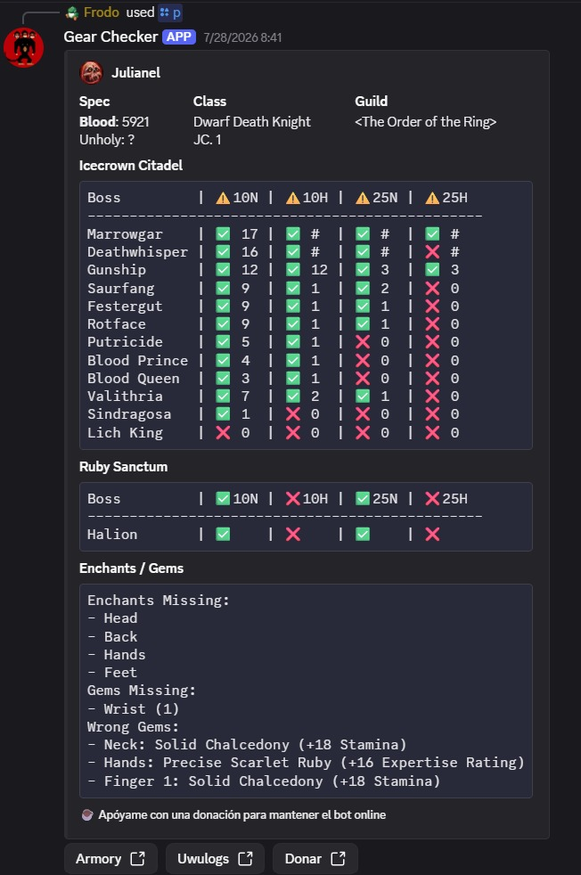

# GsChecker

Bot de Discord para consultar personajes de Warmane (WotLK), con foco en resumen de progreso PvE, calidad de equipo y DPS por boss.

Scrapea directamente `armory.warmane.com` (HTML + API JSON) y `uwu-logs.xyz`.

## Features

- **GearScore** calculado localmente a partir de los ítems equipados (tabla WotLK).
- **Resumen de personaje** (embed) con:
  - clase / raza / nivel,
  - specs activa e inactiva con ícono,
  - guild y rango dentro de la guild,
  - progreso **ICC 10/25** (Normal y Heroic) por boss,
  - **Ruby Sanctum** (Halion) por logros The Twilight Destroyer,
  - profesiones,
  - enchants y gemas faltantes,
  - GearScore por spec (cachea el GS de cada spec en Postgres para mostrarlas todas),
  - **ranking de UwU Logs** de la spec principal: puesto en el reino por Performance Points y percentil (ej. `Fire · #37 (top 1,2 %)`),
  - links a Armory y UwU Logs.
- **DPS por boss** (máximo y promedio) vía uwu-logs.xyz, con overview rápido y tabla detallada.
- **Trial of the Crusader**: logros 10N / 10H / 25N / 25H.
- **Últimos logs** con `/logs`: los 10 reportes más nuevos de UwU Logs donde aparece el personaje, con la raid de cada uno (`ICC 11/12`, `Halion`, `Toravon` u `otro raid`). uwu-logs no trae los bosses en la lista, así que se pide una vez por pelea (14 consultas, 2 a la vez) y se cachea 10 min.
- **Análisis BiS + coach por IA** (Groq) con `/ia`, contra un BiS **por reino** (Lordaeron / Icecrown) armado con lo que equipan los mejores jugadores de cada spec en Warmane.
- **Cache en memoria + Postgres** (`external_api_cache`) para reducir requests al Armory / UwU.
- **Rate limit propio + circuit breaker** para no gatillar el 429 / ban de Cloudflare del Armory.

## Comandos

| Comando                     | Descripción                                              | Reino               |
|-----------------------------|----------------------------------------------------------|---------------------|
| `/personaje <nombre> [reino]` | Perfil completo del personaje.                         | Configurable        |
| `/p <nombre> [reino]`        | Alias corto de `/personaje`.                            | Configurable        |
| `/dps <nombre> [spec]`       | DPS por boss desde UwU Logs.                            | Lordaeron           |
| `/logs <nombre> [reino]`     | Últimos 10 reportes de UwU Logs donde aparece el personaje (fecha, raid, quién lo subió, link). | Configurable |
| `/ptoc <nombre>`             | Logros ToC (10N/10H/25N/25H) en tabla.                  | Lordaeron           |
| `/ia <nombre> [reino]`       | Análisis BiS + resumen de coach por IA (requiere `GROQ_API_KEY`). | Lordaeron / Icecrown |
| `/ping`                      | Latencia actual del bot.                                | —                   |

Reinos aceptados en `[reino]` (por defecto **Lordaeron**):

- Lordaeron
- Icecrown
- Blackrock
- Onyxia
- Frostmourne

## Instalación

Requiere Python 3.11.

```bash
git clone https://github.com/joaquinmuzzi/GsChecker.git
cd GsChecker
cp .env.example .env   # y editar
```

Variables mínimas en `.env`:

```bash
DISCORD_TOKEN=tu_token
# Opcional — habilita cache externa en Postgres
DATABASE_URL=postgres://...
# Opcional — necesario solo para /ia
GROQ_API_KEY=...
```

### Dependencias

`requirements.txt` es la fuente de verdad (es lo que instala Railway) y tiene las versiones **fijas** que corre producción. Para actualizar una librería: subí la versión ahí, corré los tests y dejá que el CI lo valide antes del deploy.

`requirements-dev.txt` agrega `pytest` y `pytest-asyncio` (configuración en `pytest.ini`).

### Ejecutar

```bash
# A) Script (crea venv, instala deps y arranca)
./run.sh

# B) venv + pip
python3 -m venv venv
source venv/bin/activate
pip install -r requirements.txt
python main.py
```

### Tests

```bash
pip install -r requirements-dev.txt
python -m pytest -q
```

El CI (`.github/workflows/tests.yml`) corre los tests en cada push a `master` y en cada PR, y Railway espera a que pase antes de deployar.

## Deploy en Railway

El proyecto tiene tres servicios: el bot (`GsChecker`), el cron (`GsChecker-Cron`) y `Postgres`.

- `Procfile` — `worker: bash ./run_railway.sh` (start del bot)
- `run_railway.sh` — carga `.env` y ejecuta `python3 main.py`
- `.railway/railway.py` — infraestructura como código: builder Nixpacks, cron del preload, espera al CI (`checkSuites`). Railway **no** lo lee en cada deploy: los cambios se aplican con `railway config plan` / `railway config apply`. Ver [`.railway/README.md`](.railway/README.md).

Variables recomendadas en Railway:

- `DISCORD_TOKEN` (requerido)
- `DATABASE_URL` (opcional — pero muy recomendado para cache de GS por spec)
- `GROQ_API_KEY` (opcional — solo para `/ia`)

El bot es worker: no expone puerto HTTP. Restart policy: la default de Railway (on failure, 10 reintentos).

## Cron: precarga de datos

El bot depende de armory.warmane.com, que a menudo devuelve 429 (rate limit de Cloudflare). Para que `/personaje` responda aunque el armory esté caído, un cron precarga en Postgres el GS por spec de miles de personajes y el perfil completo de los que la gente consulta.

### Configuración (servicio `GsChecker-Cron`)

Declarada en `.railway/railway.py`:

- **Start command**: `python -m tools.run_scheduled_preload`
- **Cron schedule**: `0 3 * * *` — una vez por día a las 03:00 UTC (00:00 en Argentina)
- **Restart policy**: `Never` (el cron termina y el container se apaga)
- **Variables**: `DATABASE_URL` compartida con el bot (mismo Postgres)

Variables opcionales del cron:

- `PRELOAD_TXT_PATH` — ruta al txt semilla (default: `data/tracked_characters.txt`)
- `PRELOAD_DEFAULT_REALM` — reino asumido cuando el txt no lo especifica (default: `Lordaeron`)
- `PRELOAD_DELAY_SECONDS` — pausa entre personajes para evitar 429 (default: `2.0`)
- `PRELOAD_MAX_CHARACTERS` — corte duro por batch (default: `0` = sin límite)
- `PRELOAD_ROTATION_SIZE` — personajes no-filtrados por run (default: `500`)
- `PERSONAJE_CACHE_DELAY_SECONDS` / `PERSONAJE_CACHE_MAX_CHARACTERS` — lo mismo para la precarga de perfiles completos
- `FORCE_FILTER` — `1` para forzar el `filter_high_gs` en cualquier día
- `FORCE_BIS` — `1` para regenerar el BiS de `/ia` en cualquier día (normalmente el día 15)

### Fuentes de personajes

El cron combina dos fuentes y deduplica:

1. **`data/tracked_characters.txt`** — lista semilla (~19.6k nombres de Lordaeron) versionada en git. Un personaje por línea, con reino opcional después de una coma:

   ```text
   Samsara
   Algoritmo, Lordaeron
   Frodo, Icecrown
   ```

2. **Tabla `tracked_characters` en Postgres** — auto-populada por el bot cada vez que se usa un comando de personaje (`/p`, `/personaje`, `/dps`, `/ptoc`, `/ia`).

Los nombres se validan en todos los puntos de entrada (`src/functions/names.py`: solo letras, 2–12 caracteres), así que basura como los placeholders `C_1234567` de uwu-logs no entra ni se consulta.

### Estado persistente

El filesystem de Railway se resetea en cada deploy, así que el estado del cron vive en la tabla **`app_state`** de Postgres (con el archivo local como fallback si no hay base):

- `preload_rotation_index` — por dónde va el lote rotativo.
- `tracked_high_gs` — la lista de personajes con GS alto que genera `filter_high_gs`.

### Flujo de una corrida

Duraciones medidas en los logs de Railway (septiembre 2026).

```
   ┌───────────────────────────────────────┐
   │ GsChecker-Cron (Railway)              │
   │ Todos los días 03:00 UTC:             │
   │ python -m tools.run_scheduled_preload │
   └───────────────────────────────────────┘
                              │
                              ▼
   ┌──────────────────────────────────┐
   │ ¿Día 1 del mes o FORCE_FILTER=1? │
   └──────────────────────────────────┘
             SÍ │                                   │ NO
                ▼                                   │
   ┌──────────────────────────────────────────┐     │
   │ filter_high_gs.py                        │     │
   │ • summary API de cada nombre de la lista │     │
   │ • GS desde gear IDs                      │     │
   │ • guarda los ≥5000 GS en                 │     │
   │   app_state.tracked_high_gs              │     │
   │ • 1 request cada 2s + delay: más de 12h  │     │
   └──────────────────────────────────────────┘     │
                │                                   │
                └─────────────┬─────────────────────┘
                              ▼
   ┌────────────────────────────────────────────────┐
   │ run_scheduled_preload.py — GS por spec         │
   │                                                │
   │ PASO 1 — Filtrados (app_state.tracked_high_gs) │
   │ PASO 2 — Lote rotativo: 500 no-filtrados desde │
   │          app_state.preload_rotation_index      │
   │          (vuelve a 0 al llegar al final)       │
   │ → external_api_cache, source=character_spec_gs │
   │   TTL 30 días                                  │
   │ ~50 min por 500 personajes                     │
   └────────────────────────────────────────────────┘
                              │
                              ▼
   ┌──────────────────────────────────────────────────┐
   │ preload_personaje_cache.py — perfil completo     │
   │                                                  │
   │ • personajes de la tabla tracked_characters      │
   │   (los que la gente consultó, ~95)               │
   │ • mismo cálculo que /p (_compute_personaje_base) │
   │ → external_api_cache, source=command_personaje   │
   │   TTL 25h                                        │
   │ • no guarda perfiles incompletos                 │
   │ ~55 min                                          │
   └──────────────────────────────────────────────────┘
```

### Cobertura del lote rotativo

Con ~19.6k nombres, 500 por corrida y una corrida por día, la lista completa se recorre en **~40 días**. Los filtrados (GS alto) se refrescan todos los días.

### Flujo end-to-end

1. Un usuario ejecuta `/p Samsara Lordaeron` → el bot registra `(Samsara, Lordaeron)` en `tracked_characters`.
2. En la próxima corrida, el cron recalcula el perfil completo y lo guarda como `command_personaje` (y el GS por spec como `character_spec_gs`).
3. La próxima vez que alguien consulte a Samsara, `/p` responde desde Postgres al instante. Si el cache venció y el armory está rate-limitado, sirve el último perfil bueno (stale) en vez de fallar.

## BiS por reino (`/ia`)

Warmane no es blizzlike en todos lados: **Lordaeron** tiene los jefes reforzados (más vida y daño, enrage más corto, sin buff de ICC) e **Icecrown** es como el original con el buff del 30 %. Por eso `/ia` no usa guías genéricas de WotLK: compara contra lo que realmente equipan los mejores jugadores de cada spec **en ese reino**.

`tools/build_bis_from_armory.py` lo genera en dos pasos:

```bash
python -m tools.build_bis_from_armory collect --realm Lordaeron   # ~45 min, retoma si se corta
python -m tools.build_bis_from_armory collect --realm Icecrown
python -m tools.build_bis_from_armory aggregate                   # escribe static/bis/<reino>.json
```

1. **Candidatos**: jugadores de cada clase/spec en los rankings ICC 25H de uwu-logs del reino (con logs del último año).
2. **Equipo real**: del armory, ítems + encantamientos + gemas, spec activa y stats (esquivar, aguante, hit, expertise).
3. **Rol**: DK con ≥18 % de esquivar → tanque (muestra: tanques 23-29 %, DPS 6-13 %); Feral con ≥3300 de aguante → oso; Protection siempre tanque.
4. **Guía**: con los 12 de más GS de cada spec/rol, por slot los ítems más usados (sin PvP), los encantamientos que lleva la mayoría (mostrados por su efecto, vía tooltips de Wowhead), la gema meta y Nightmare Tear si la usa la mayoría, y como cap de hit/expertise lo que alcanzan 3 de cada 4 top.

Las specs con menos de 5 jugadores en el reino quedan sin guía y `/ia` lo avisa.

**Actualización automática**: el cron lo regenera solo **el día 15 de cada mes** (`python -m tools.build_bis_from_armory monthly`, ~3 h extra después del preload; o cualquier día con `FORCE_BIS=1`). Recolecta los dos reinos desde cero, hace una segunda pasada (`--boost`: todos los jefes de ICC en 25H/25N, hasta 80 personajes) para las specs con menos de 8 jugadores, y **publica en Postgres** (`app_state`, claves `bis_guides:<reino>`), porque el disco del contenedor del cron no le llega al bot. Si una corrida trae menos del 80 % de las guías publicadas (uwu-logs caído, armory rate-limitado) no se publica y quedan las anteriores.

El bot lee las guías de Postgres, las relee cada 6 h (toma las nuevas sin reiniciar) y, si no hay nada publicado, usa `static/bis/` del repo. Para publicar a mano lo que haya en `static/bis/`: `python -m tools.build_bis_from_armory publish`. Los datos crudos (`data/bis_raw/`) no se versionan.

## Logging

Cada invocación de comando emite una línea estructurada en el logger `gschecker.commands`:

```text
command=p user=Frodo(123456789) guild=Durotar(987654321) character='Samsara' realm='Lordaeron'
```

Los logs van a:

- **stdout** — visibles en Railway → *Deploy Logs* (filtrando por `@level:info`).
- **`logs/bot.log`** — rotating file (2 MB × 5 backups) por si corrés local.
- **`logs/bot-errors.log`** — mismo rotating solo para `ERROR`.

Los sub-loggers heredan del logger raíz `gschecker` (configurado en `main.py`):

- `gschecker.commands` — comandos slash.
- `gschecker.warmane` — integración Armory.
- `gschecker.profile_scraper` — parsing de gear.
- `gschecker.postgres` — cache externa.
- `gschecker.preload_cron` / `gschecker.preload_personaje_cache` — cron.

## Arquitectura

```
main.py                        # arranque, sync slash, lock de proceso, logging global
gearscore.py                   # cálculo local de GS a partir de item IDs (static/GS.json)
profile_scraper.py             # scraping HTML de armory.warmane.com (gear, enchants, gems)

src/
├── controller/
│   └── commands.py            # slash commands + cálculo del perfil compartido con el cron
│                              #   (_compute_personaje_base, _resolve_uwu_icc_kills)
├── functions/
│   ├── warmane.py             # summary/specs/achievements/gear/stats/guild-rank
│   ├── uwu.py                 # integración uwu-logs.xyz (overview + DPS por boss)
│   ├── embeds.py              # armado de embeds y tablas monoespaciadas
│   ├── names.py               # validación de nombres de personaje
│   ├── rate_limit.py          # token bucket + circuit breaker del Armory
│   └── cache.py               # get/set/get_stale in-memory
├── audit/
│   ├── auditor.py             # comparación equipo vs BiS guide
│   ├── bis_guides.py          # carga el BiS por reino (static/bis/) + roles
│   ├── coach.py               # resumen narrativo vía Groq
│   ├── integration.py         # bridge scraper → audit
│   └── models.py              # Pydantic models
├── db/
│   └── postgres.py            # external_api_cache, tracked_characters, app_state
└── schemas/
    └── constants.py           # TTLs, caches in-memory, rate limit, mapeos de boss/spec

static/
├── GS.json                    # tabla WotLK: item_id → ilvl bucket → GS por slot type
├── gem_data.json              # mapeos gem enchant_id → item info
├── item_sockets_cache.json    # sockets por item_id (evita hits a evowow)
├── raid_items_extra.json      # IDs extra para precarga
└── bis/                        # BiS por reino (tools/build_bis_from_armory.py)

tools/
├── run_scheduled_preload.py   # entrypoint del cron (filtro + GS por spec + perfiles)
├── filter_high_gs.py          # genera la lista de GS alto (día 1 del mes)
├── preload_character_gs.py    # cálculo y guardado de GS por spec
├── preload_personaje_cache.py # precarga del perfil completo de /personaje
├── preload_item_sockets_cache.py  # precarga sockets de items de raid
├── build_bis_from_armory.py  # genera el BiS por reino para /ia (static/bis/)
└── seed_names.py              # arma data/tracked_characters.txt desde rosters / uwu-logs

.railway/railway.py            # infraestructura de Railway como código
.github/workflows/tests.yml    # CI: pytest en cada push / PR
```

## Cache

Dos niveles:

- **In-memory** (`src/schemas/constants.py`): dicts `{key: (timestamp, value)}` por dominio (SUMMARY, GEAR, ACHIEVEMENTS, STATS, …) con TTLs entre 120 s y 300 s. Se pierde al reiniciar el proceso.
- **Postgres** (`external_api_cache`): perfiles completos de `/personaje` (`COMMAND_PERSONAJE_TTL = 25h`) y GS por spec (`CHARACTER_SPEC_GS_TTL = 30 días`). Requiere `DATABASE_URL`.

Nunca se persiste una respuesta incompleta. Si el Armory falla a mitad de un perfil (por ejemplo, 429 en una categoría de logros), los ❌ resultantes significarían "no pudimos leerlo", no "no lo hizo": ese perfil no se guarda, y `/p` muestra el último perfil bueno de Postgres si existe.

## Diagnóstico y notas conocidas

- El Armory de Warmane rate-limita por IP (~5-6 requests / 10 s → 429; abuso sostenido → "error code: 1015"). Todo el tráfico pasa por `_armory_request`: token bucket de 1 request cada 2 s (ráfaga de 3), hasta 4 intentos con backoff de 8–20 s ante 429/5xx, y circuit breaker (60 s tras 3 fallos en 30 s, 90 s si aparece 1015).
- **Halion**: la página de estadísticas de Warmane muestra `- -` en todas las filas "Halion kills (...)", incluso para personajes con el logro ganado. Por eso Ruby Sanctum se basa sólo en los logros.
- `/dps` depende 100% de uwu-logs.xyz; si están lentos, el timeout es 45 s. Usa la spec principal del personaje (una spec de DPS con logs antes que healer/tank; entre esas, la que tiene más bosses con logs en `/character`; lo mismo para el ranking de `/p`) o la que se pase en `spec` (`frost`, `holy` y `prot` se resuelven según la clase). Como `/top` de uwu-logs no filtra por jugador, pide hasta 10 000 filas de la spec por boss y modo (2 consultas en paralelo; ante un 429 de uwu-logs espera y reintenta) y se queda con las del personaje. Si la spec tiene más filas que eso, la columna Raids sale con `+` (por ejemplo `38+`): pueden faltar las raids de menor DPS, así que el máximo es exacto y el promedio queda algo inflado.
- Kills de Marrowgar y Deathwhisper en 10H/25N/25H (`/p` y el cron): se buscan en la lista de jugadores de cada spec de uwu-logs (hasta 10 000, cacheada 1 h y compartida entre personajes). Si uwu-logs no responde quedan sin dato en vez de ❌. Si `/character` de uwu-logs devuelve el personaje como `Unknown-...` (sin perfil, aunque figure en los rankings), `/p`, `/dps` y el cron usan la clase del armory para buscarlo en las 3 specs.
- El GS por spec se sirve desde Postgres una vez que el bot vio al personaje en esa spec; primera vez muestra `?` en las specs no activas.
- La API JSON del Armory (`/api/character/.../summary`) no devuelve `gearScore` — se calcula siempre localmente desde el equipo scrapeado.

## Ejemplo



## Code Reuse

Este proyecto reutiliza ideas y mapeos de IDs / logros inspirados en **WarmaneProfileParser** (MIT):

- <https://github.com/Ridepad/WarmaneProfileParser>

## Licencia

MIT — ver [LICENSE](LICENSE).
